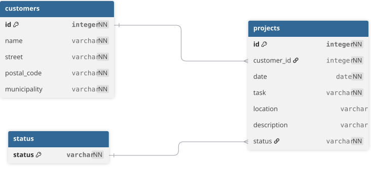
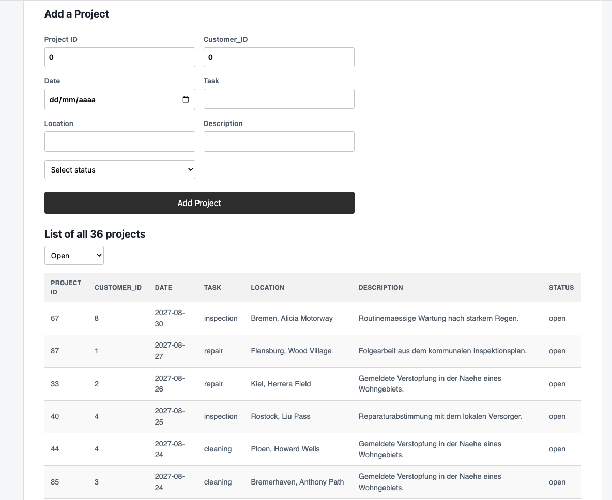
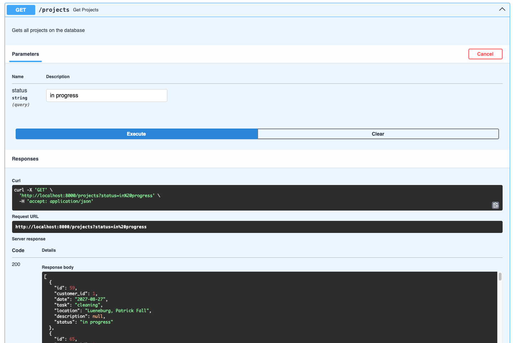

# Sewage Pipe Project Challenge
[](https://wakatime.com/badge/user/018b251f-0e34-47a2-be9d-82c5e052e073/project/9933f327-9f89-4fa3-9f83-e81d49dfdf0d)

Implementation of the project: schema, migrations, data import, FastAPI endpoints, and a Svelte frontend to visualize and manage sewage pipe projects.

## Stack

- PostgreSQL 17
- FastAPI
- Svelte + Vite + TypeScript

## Architecture & Decisions

### Database schema



- `id` and `customer_id` use the `INTEGER` values from the generated data instead of generating new UUIDs.
- `postal_code` is stored as `VARCHAR`, not `INTEGER`, because of zeros on the left
- `location` and `description` are nullable according to faker data.
- `id` and `customer_id` are positive numbers to prevent weird data on the database.

### API (`FastAPI`)

- `GET /projects` returns all projects, ordered by `date DESC`. Accepts an optional `?status=` query parameter to filter by status.
- `POST /projects` creates a new project. Validates `id` and `customer_id` as positive integers via Pydantic.

### Frontend (Svelte)

- Single-page view: project table (already sorted by date, filterable by status) plus a form to add new projects.
- Filtering re-queries the API with `?status=` rather than filtering client-side.

## Running the project

```bash
make up
make data
make migrate-up
make import-data
```

If default ports are already in use locally:

```bash
POSTGRES_PORT=15432 ADMINER_PORT=18080 make up
```

- Frontend: http://localhost:5173
- API docs: http://localhost:8000/docs
- Adminer: http://localhost:8080 (or the overridden port)

## Screenshots



